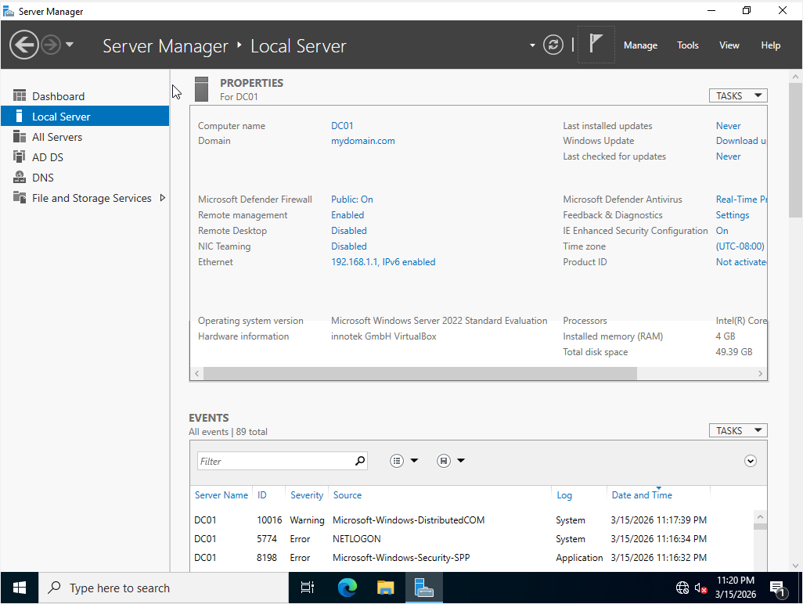
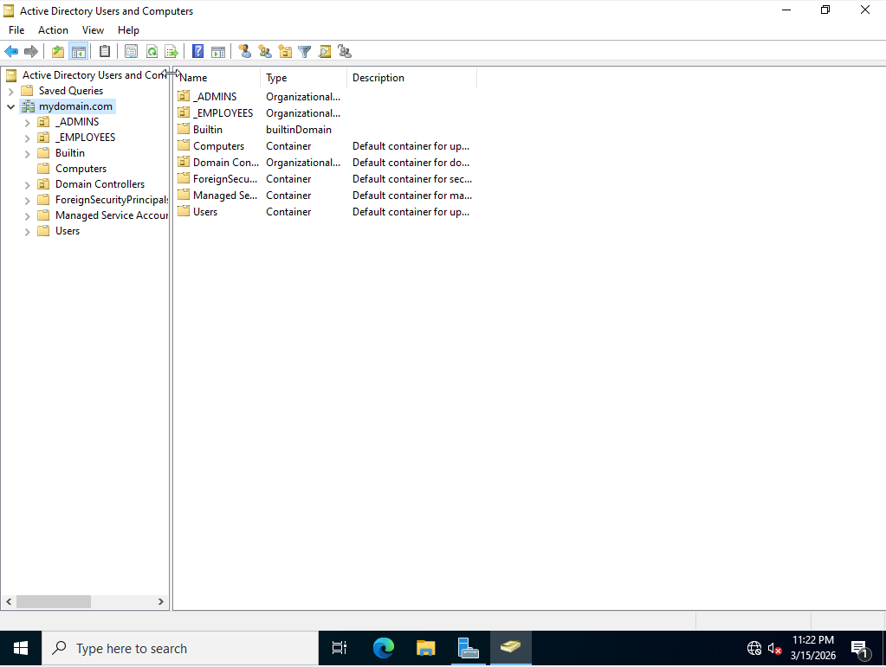
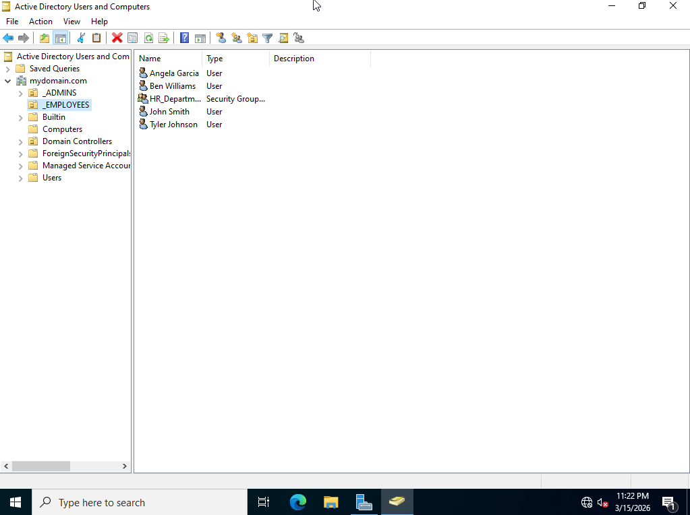
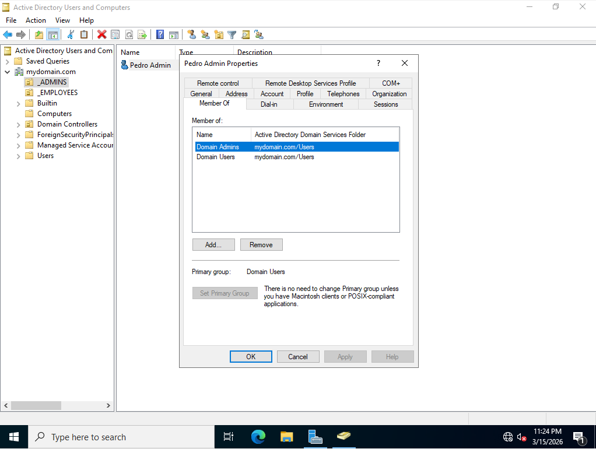
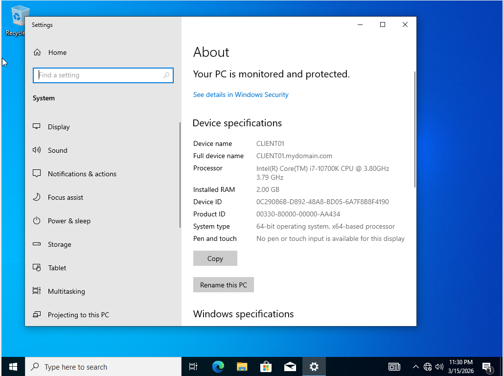

# Active Directory Home Lab

A virtualized Active Directory environment built from scratch using VirtualBox on Windows. Configured Windows Server 2022 as a Domain Controller and joined a Windows 10 Pro client to the domain.

## Environment
- Hypervisor: Oracle VirtualBox
- Domain Controller: Windows Server 2022 Standard Evaluation
- Client: Windows 10 Pro
- Network: VirtualBox Internal Network (intnet)
- Domain: mydomain.com
- DC IP: 192.168.1.1

## What I Built
- Promoted Windows Server 2022 to a Domain Controller for mydomain.com
- Configured AD DS and DNS on the Domain Controller
- Created Organizational Units: _ADMINS and _EMPLOYEES
- Created standard user accounts (jsmith, agarcia, bwilliams, tjohnson) in _EMPLOYEES
- Created admin account (a-pedro) in _ADMINS and added to Domain Admins group
- Created HR_Department security group with employee members
- Joined a Windows 10 Pro client to the domain and verified Kerberos authentication

## Key Skills Demonstrated
- Active Directory Domain Services (AD DS)
- DNS configuration
- Organizational Unit design
- User and group management
- Least privilege (separate admin and standard accounts)
- Domain join and Kerberos authentication
- Virtual networking

## Screenshots

